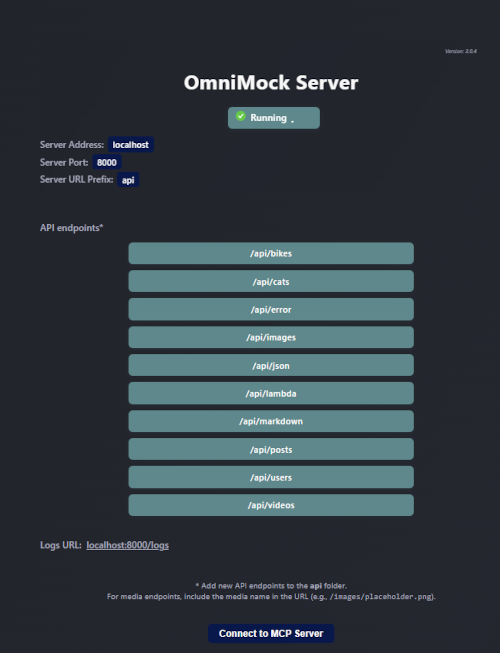

# OmniMock

[](https://img.shields.io/github/v/release/piyook/mock-api-framework-template)
[](https://github.com/piyook/mock-api-framework-template/actions/workflows/tests.yaml/badge.svg)
[](https://opensource.org/licenses/MIT)

## Table of Contents

- [Overview](#overview)
- [Quick Start](#quick-start)
  - [Prerequisites](#prerequisites)
  - [Installation & Setup](#installation--setup)
  - [Alternative: Local Development](#alternative-local-development)
  - [Useful Commands](#useful-commands)
- [Creating API Endpoints](#creating-api-endpoints)
  - [File-Based Routing](#1-file-based-routing)
  - [Handler Implementation](#2-handler-implementation)
  - [Database Integration](#3-database-integration-optional)
- [Data Management](#data-management)
  - [Seeding Options](#seeding-options)
  - [Git LFS for Large Files](#git-lfs-for-large-files)
- [Serving Static Resources](#serving-static-resources)
  - [Images and Videos](#images-and-videos)
  - [Markdown Files](#markdown-files)
  - [JSON Files](#json-files)
- [Advanced Features](#advanced-features)
  - [Custom Middleware](#custom-middleware)
  - [Error Testing](#error-testing)
  - [CORS Configuration](#cors-configuration)
  - [AWS Lambda Development](#aws-lambda-development)
- [Request Logging](#request-logging)
  - [Enable Logging](#enable-logging)
  - [Implement Logging](#implement-logging)
- [Configuration](#configuration)
  - [Environment Variables](#environment-variables)
  - [URL Structure Examples](#url-structure-examples)
- [MCP Server Integration (Experimental)](#mcp-server-integration-experimental)
  - [Setup](#setup)
  - [Available Tools](#available-tools)
  - [Debugging MCP](#debugging-mcp)
  - [Known Issues](#known-issues)
- [Development Workflow](#development-workflow)
  - [Best Practices](#best-practices)
  - [Folder Structure](#folder-structure)
- [Contributing](#contributing)
- [Resources](#resources)

## Overview

OmniMock is a quick-to-setup standalone local mock API framework for quickly developing API endpoints on localhost. Perfect for testing API code, rapid prototyping, and developing frontend clients before deploying to live servers.

Built with **Fastify** and TypeScript, this framework can run directly on your local machine or in Docker containers.

### Key Features

- **Static File Serving**: JSON, text, images (with dynamic resizing), videos, and markdown
- **Database Operations**: CRUD operations with persistent or temporary mock data
- **AWS Lambda Testing**: Develop and test Lambda functions locally
- **Custom Middleware**: Transform input/output with custom logic
- **Error Mocking**: Test frontend error handling with configurable error responses
- **Request Logging**: Store and view API requests at `localhost:8000/logs`
- **MCP Server**: Experimental LLM agent integration for server management

## Quick Start

### Prerequisites

- Node.js 20+
- Docker

### Installation & Setup

1. **Clone and install dependencies**

   ```bash
   npm install
   ```

2. **Start with Docker** (recommended)

   ```bash
   npm start
   ```

3. **View your APIs**

   - Dashboard: http://localhost:8000/
   - API list: http://localhost:8000/api



### Alternative: Local Development

For active development:

```bash
npm run dev
```

### Useful Commands

| Command           | Description                    |
| ----------------- | ------------------------------ |
| `npm start`       | Start in Docker                |
| `npm stop`        | Stop and remove containers     |
| `npm run rebuild` | Rebuild containers             |
| `npm run torch`   | Destroy everything and rebuild |
| `npm run dev`     | Run locally (for development)  |

## Creating API Endpoints

### 1. File-Based Routing

The system uses NextJS-style file-based routing. Create a folder in `/api` that maps to your desired route.

**Example: Creating `/api/users`**

```bash
mkdir src/api/users
```

### 2. Handler Implementation

Create `api.ts` in your new folder. Each handler is a Fastify plugin that receives the `FastifyInstance` and registers routes on it:

```typescript
// src/api/users/api.ts
import type { FastifyInstance } from 'fastify';

async function handler(fastify: FastifyInstance, pathName: string) {
	fastify.get(`/${pathName}`, async (request, reply) => {
		// Your GET logic here
		return reply.send({ users: [] });
	});

	fastify.post(`/${pathName}`, async (request, reply) => {
		// Your POST logic here
		const body = request.body;
		return reply.send({ success: true });
	});
}

export default handler;
```

#### Route Parameters

Access dynamic path segments and query strings via the Fastify request object:

```typescript
// Dynamic path: /api/users/:id
fastify.get(`/${pathName}/:id`, async (request, reply) => {
	const { id } = request.params as { id: string };
	return reply.send({ id });
});

// Query parameters: /api/bikes?type=KawasakiNinja
fastify.get(`/${pathName}`, async (request, reply) => {
	const { type } = request.query as { type: string };
	return reply.send({ type });
});
```

### 3. Database Integration (Optional)

#### Create Models

Models go in the `/models` directory:

```typescript
// models/users.ts
export interface UserModel {
	id: string;
	name: string;
	email: string;
}
```

#### Manage Data

Data is stored in `src/data/data.json`. You can read, write, and update it directly in your handlers:

```typescript
import { readData, writeData } from '../../utilities/dataUtils';

fastify.get(`/${pathName}`, async (request, reply) => {
	const data = await readData();
	return reply.send(data.users ?? []);
});

fastify.post(`/${pathName}`, async (request, reply) => {
	const body = request.body as UserModel;
	const data = await readData();
	data.users = [...(data.users ?? []), body];
	await writeData(data);
	return reply.status(201).send(body);
});
```

#### REST Endpoints

Typical CRUD routes to implement for a resource:

| Method   | Path          | Description      |
| -------- | ------------- | ---------------- |
| `GET`    | `/users`      | List all users   |
| `GET`    | `/users/:id`  | Get user by ID   |
| `POST`   | `/users`      | Create user      |
| `PUT`    | `/users/:id`  | Update user      |
| `DELETE` | `/users/:id`  | Delete user      |

## Data Management

### Seeding Options

Choose one of three approaches:

#### Option 1: Manual Data Entry

Add data via POST/PUT requests (temporary, lost on restart unless persisted to `data.json`)

#### Option 2: Fake Data Generation

Use seeders with faker.js for random data:

```typescript
// seeders/user-seeder.ts
import { faker } from '@faker-js/faker';
import { writeData } from '../utilities/dataUtils';

export async function seedUsers() {
	const users = Array.from({ length: 10 }, () => ({
		id: faker.string.uuid(),
		name: faker.person.fullName(),
		email: faker.internet.email(),
	}));

	const data = await readData();
	await writeData({ ...data, users });
}
```

#### Option 3: Persistent Data

Create or edit `data.json` in the `/data` folder for consistent data across restarts.

### Git LFS for Large Files

For large database files, images, or videos:

```bash
# Track database files
git lfs track --filename src/data/data.json

# Track image files
git lfs track "*.png"
```

## Serving Static Resources

### Images and Videos

Store files in `src/resources/{images|videos}` and access via:

```
http://localhost:8000/api/images/placeholder.png
http://localhost:8000/api/videos/sample.mp4
```

#### Listing available media

List all available media by visiting the media root folder (`/api/{images|videos}`) in a browser or by sending a GET request to:

```
/api/{images|videos}/list
```

This path returns a JSON object describing the media type and available files in the `/resources/{images|videos}` folder:

```json
{
  "mediaType": "image",
  "files": [
    "placeholder.png",
    "placeholder2.png"
  ]
}
```

#### Dynamic Image Resizing

Resize PNG images by adding width and height parameters:

```
http://localhost:8000/api/images/placeholder.png?width=300&height=500
```

### Markdown Files

Store in `src/resources/markdown` with code highlighting support:

```
http://localhost:8000/api/markdown/demo
```

### JSON Files

Store in `src/resources/json`:

```
http://localhost:8000/api/json/demo
```

## Advanced Features

### Custom Middleware

Register Fastify hooks or plugins to intercept or transform requests and responses:

```typescript
// Add a hook to all routes in a handler
fastify.addHook('onRequest', async (request, reply) => {
	// Custom logic before handler runs (e.g. auth checks, logging)
});

fastify.addHook('onSend', async (request, reply, payload) => {
	// Transform the response payload before sending
	return payload;
});
```

### Error Testing

Mock API errors for frontend testing:

```
# Default 404 error
http://localhost:8000/api/error

# Custom error
http://localhost:8000/api/error?status=500&message=Internal%20Server%20Error
```

### CORS Configuration

CORS is handled via the `@fastify/cors` plugin, which is registered globally. To customise allowed origins or methods, update the CORS config in `src/server.ts`:

```typescript
import cors from '@fastify/cors';

await fastify.register(cors, {
	origin: '*', // or 'http://localhost:3000'
	methods: ['GET', 'POST', 'PUT', 'DELETE'],
});
```

### AWS Lambda Development

Develop Lambda functions in `src/lambdas` directory. Use the `requestToApiGatewayProxyEvent` utility to convert a Fastify request object into an AWS API Gateway Proxy Event:

```typescript
import { requestToApiGatewayProxyEvent } from '../../utilities/lambdaUtils';
import { myLambdaHandler } from '../../lambdas/my-lambda';

fastify.get(`/${pathName}`, async (request, reply) => {
	const event = requestToApiGatewayProxyEvent(request);
	const result = await myLambdaHandler(event);
	return reply.status(result.statusCode).send(result.body);
});
```

Lambda functions created using `NodeJSFunction()` in the AWS CDK will be built and bundled using esbuild. Functions developed in this framework should work as expected, but it is recommended to verify behaviour using LocalStack or in a test AWS sandbox account.

## Request Logging

Monitor API requests and responses at `localhost:8000/logs`.


### Enable Logging

Set environment variables in `.env`:

```
LOG_REQUESTS=ON
DELETE_LOGS_ON_SERVER_RESTART=ON
```

### Implement Logging

Add to your handlers:

```typescript
import logger from '../../utilities/logger';

logger({
	data: extractedData,
	pathName,
	type: 'GET',
});
```

## Configuration

### Environment Variables

Customize your setup in `.env`:

```
# Change API prefix (default: "api")
USE_API_URL_PREFIX=api

# Change port (default: 8000)
SERVER_PORT=8000

# Logging
LOG_REQUESTS=ON
DELETE_LOGS_ON_SERVER_RESTART=ON
```

### URL Structure Examples

With different `USE_API_URL_PREFIX` settings:

- Default: `localhost:8000/api/users`
- Empty: `localhost:8000/users`
- Custom: `localhost:8000/things/users`

## MCP Server Integration (Experimental)

### Setup

1. **Build MCP server**

   ```bash
   npm run mcp:build
   ```

2. **Configure your LLM agent** with the server path:

   ```
   <path_to_project>/src/mcp/server.js
   ```

### Available Tools

- **Server Management**: Start, stop, rebuild, and check endpoints
- **Endpoint Creation**: Generate new API endpoints via LLM
- **Media Creation**: Ask the LLM to generate images and videos to serve locally


### Debugging MCP

Test the MCP server with the inspector:

```bash
npm run mcp:debug
```

### Known Issues

#### Node Version Managers

With NVM/FNM on Windows, you may need to:

- Specify full path to node binary, or
- Add fnm aliases directory to system PATH

#### Custom Ports

If changing from port 8000, update `mcp/server.ts` PORT variable and rebuild:

```bash
npm run mcp:build
```

## Development Workflow

### Best Practices

1. **Development**: Use `npm run dev` for active development
2. **Testing**: Use `npm start` for Docker-based testing
3. **File Organisation**: Follow the established folder structure
4. **Error Handling**: Test error scenarios using the error endpoint
5. **Logging**: Enable logging during development for debugging

### Folder Structure

```
src/
├── api/                 # API endpoints (file-based routing)
├── models/              # TypeScript interfaces / data models
├── seeders/             # Database seeders
├── lambdas/             # AWS Lambda functions
├── data/                # Persistent JSON data store
├── resources/           # Static files
│   ├── images/
│   ├── videos/
│   ├── markdown/
│   └── json/
├── logs/                # Request logs
├── mcp/                 # MCP server files
└── utilities/           # Helper functions
```

## Contributing

This project uses the MIT license. For issues with the experimental MCP server, please report them at: https://github.com/piyook/mock-api-framework-template/issues

## Resources

- [Fastify Documentation](https://fastify.dev/docs/latest/)
- [@fastify/cors](https://github.com/fastify/fastify-cors)
- [Model Context Protocol](https://modelcontextprotocol.io/)
