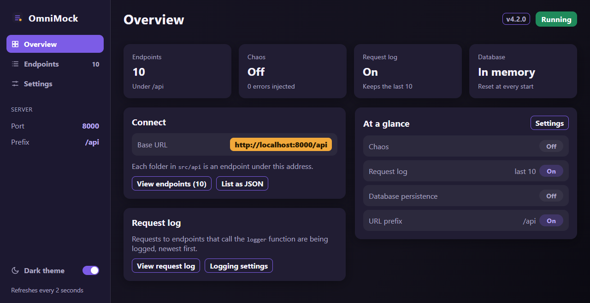
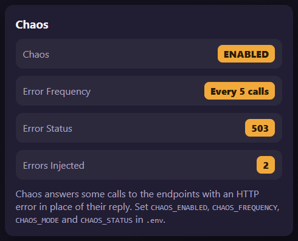
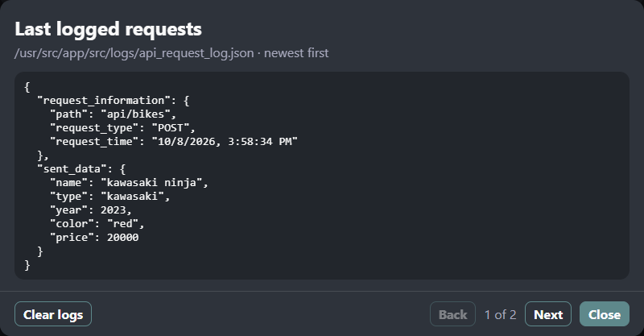

# OmniMock

[](https://github.com/piyook/omnimock/releases)
[](https://github.com/piyook/omnimock/actions/workflows/tests.yaml)
[](https://opensource.org/licenses/MIT)

OmniMock is a mock API server that runs on localhost. Each folder you add to `src/api` becomes an endpoint, so you can build and test a frontend or API client before the real backend exists.

It is built with [Fastify](https://fastify.dev/) and TypeScript, and runs either in Docker or directly with Node.

> **Using a coding agent?** [`llms.txt`](llms.txt) is a short guide to this project written for coding agents (Claude Code, Cursor, Copilot and the like): the commands, the conventions and the things that are easy to get wrong. Point your agent at it before asking it to add endpoints or change the server.



## Contents

- [What it does](#what-it-does)
- [Quick start](#quick-start)
- [Commands](#commands)
- [Configuration](#configuration)
- [The dashboard](#the-dashboard)
- [Adding an endpoint](#adding-an-endpoint)
- [The mock database](#the-mock-database)
- [Serving files](#serving-files)
- [Testing failures](#testing-failures)
  - [The error endpoint](#the-error-endpoint)
  - [Chaos mode](#chaos-mode)
- [Request logging](#request-logging)
- [CORS](#cors)
- [AWS Lambda functions](#aws-lambda-functions)
- [MCP server (experimental)](#mcp-server-experimental)
- [Working on OmniMock](#working-on-omnimock)
- [Upgrading from v3](#upgrading-from-v3)
- [Licence and resources](#licence-and-resources)

## What it does

- **File-based routing**: a folder in `src/api` with an `api.ts` file is an endpoint.
- **Mock database**: in-memory models with create, read, update and delete, seeded with fake data or from a JSON file, and optionally saved to disk.
- **Static files**: images (resized on request), videos, markdown and JSON.
- **Error endpoint**: returns whichever HTTP error you ask for.
- **Chaos mode**: fails some calls with an HTTP error, to test how a client copes with intermittent failures.
- **Request log**: keeps the most recent requests and shows them in the dashboard.
- **Dashboard**: one page showing the server settings, every endpoint, the chaos settings and the request log.
- **AWS Lambda**: run a Lambda handler behind an endpoint, with the request converted to an API Gateway event.
- **MCP server** (experimental): lets an LLM agent start, stop and add endpoints to the mock server.

## Quick start

You need Node.js 24 (the exact version is in `.nvmrc`). Docker is needed only for `npm start`.

```bash
npm install
```

This also installs the dashboard's dependencies in `ui/`.

Then start the server, in Docker:

```bash
npm start
```

or directly with Node, restarting when a file in `src` changes:

```bash
npm run dev
```

Open:

- http://localhost:8000/ for the dashboard
- http://localhost:8000/api for the list of endpoints as JSON
- http://localhost:8000/api/users for an example endpoint

**Docker or Node?** The Docker image holds a copy of the code and of `.env`, with nothing mounted from your machine. After changing either, run `npm run rebuild`. With `npm run dev` a change to a file in `src` restarts the server by itself, which makes it the better choice while you are adding endpoints.

## Commands

| Command | What it does |
| --- | --- |
| `npm start` | Start the server in Docker |
| `npm stop` | Stop it and remove its containers and volumes |
| `npm run rebuild` | Rebuild the image and start again (after changing code or `.env`) |
| `npm run torch` | Remove everything Docker holds for the project and rebuild |
| `npm run dev` | Build the dashboard, then run the server with Node and restart it on changes |
| `npm run dev:server` | Run the server with Node without building the dashboard |
| `npm run ui-dev` | Dashboard dev server with hot reload (see [Working on the dashboard](#working-on-the-dashboard)) |
| `npm run compile-ui` | Build the dashboard into `ui/dist` |
| `npm run lint` | Lint and format check (Biome); `npm run lint:fix` applies fixes |
| `npm run typecheck` | Type-check the server (`tsc`) and the dashboard (`svelte-check`) |
| `npm test` | Unit tests (Vitest); `npm run test:coverage` adds coverage |
| `npm run test:e2e` | Cypress tests, against a server with chaos off and one with chaos on |
| `npm run audit` | `npm audit` for the server and the dashboard |
| `npm run mcp:build` | Build the MCP server |

If the dashboard fails to build, `npm run dev` says so and still starts the server. The endpoints work, and the page at `/` tells you to run `npm run compile-ui`.

## Configuration

Settings live in `.env`. Restart the server after changing one (in Docker, `npm run rebuild`).

| Setting | Default in `.env` | What it does |
| --- | --- | --- |
| `PROJECT_NAME` | `mock-api-framework` | Name shown in the dashboard and used for the Docker image |
| `SERVER_PORT` | `8000` | Port the server listens on |
| `USE_API_URL_PREFIX` | `api` | Path every endpoint sits under; leave empty for none |
| `LOG_REQUESTS` | `ON` | Keep a log of requests (see [Request logging](#request-logging)) |
| `DELETE_LOGS_ON_SERVER_RESTART` | `ON` | Empty the log each time the server starts |
| `MAX_LOGGED_REQUESTS` | `10` | How many requests the log keeps, 1 to 100 |
| `CHAOS_ENABLED` | `OFF` | Turn [chaos mode](#chaos-mode) on |
| `CHAOS_FREQUENCY` | `5` | Fail 1 in this many calls (1 = every call) |
| `CHAOS_MODE` | `every` | `every` (each Nth call) or `random` (a 1 in N chance per call) |
| `CHAOS_STATUS` | `500` | HTTP status of the injected error, 400 to 599 |
| `MOCK_DB_PERSIST` | not set (off) | `ON` saves the mock database to disk and loads it at start |
| `MOCK_DB_PERSIST_PATH` | `.mock-data/mock-db.json` | Where the database is saved |
| `MOCK_DB_SEED_ON_START` | not set (off) | `ON` runs the seeders at every start, even when a saved database was loaded |

`PROJECT_NAME`, `SERVER_PORT` and `USE_API_URL_PREFIX` are required: the server stops at start-up if one is missing from the environment.

The prefix changes the URL of every endpoint:

| `USE_API_URL_PREFIX` | URL of the users endpoint |
| --- | --- |
| `api` | `localhost:8000/api/users` |
| empty | `localhost:8000/users` |
| `things` | `localhost:8000/things/users` |

Two things do not follow these settings:

- The JSON list of endpoints is always at `/api`, whatever the prefix.
- `docker-compose.yml` publishes port 8000. To use another port in Docker, change the `ports` line there as well as `SERVER_PORT`.

## The dashboard

The page at `/` shows:

- **Server**: version, whether the server is answering, port, URL prefix, project name and whether the database is being saved.
- **API endpoints**: a link to each endpoint's GET reply.
- **Chaos**: whether chaos mode is on, how often it fails a call, with which status, and how many errors it has injected.
- **Request log**: the logging settings, and **View request log** to page through the logged requests.

It refreshes every two seconds. It is a Svelte app in `ui/`, built into `ui/dist` and served by the mock server.

These routes belong to the server itself and are never under the prefix:

| Route | Returns |
| --- | --- |
| `GET /` | The dashboard |
| `GET /api` | The endpoints, as a JSON list of paths |
| `GET /ping` | `{ "response": "server is running" }` |
| `GET /ui-meta` | Everything the dashboard shows, as JSON |
| `GET /ui-request-log` | The logged requests, newest first |
| `DELETE /ui-request-log` | Empties the request log |

## Adding an endpoint

1. Create a folder in `src/api`. Its name is the endpoint's path: `src/api/tasks` becomes `/api/tasks`.
2. Add an `api.ts` to it whose default export is a function taking the Fastify app and the endpoint's path, and adding routes to the app.
3. Restart the server. `npm run dev` does this for you; in Docker, run `npm run rebuild`.

```typescript
// src/api/tasks/api.ts
import type { FastifyInstance, FastifyReply, FastifyRequest } from 'fastify';

type TaskParams = { id: string };
type TaskQuery = { status?: string };

// pathName already includes the prefix, e.g. "api/tasks"
function registerTaskRoutes(app: FastifyInstance, pathName: string) {
	// GET /api/tasks?status=open
	app.get(
		`/${pathName}`,
		async (
			request: FastifyRequest<{ Querystring: TaskQuery }>,
			reply: FastifyReply,
		) => {
			const { status } = request.query;
			reply.send({ tasks: [], status: status ?? 'any' });
		},
	);

	// GET /api/tasks/42
	app.get(
		`/${pathName}/:id`,
		async (
			request: FastifyRequest<{ Params: TaskParams }>,
			reply: FastifyReply,
		) => {
			reply.send({ id: request.params.id });
		},
	);

	// POST /api/tasks
	app.post(`/${pathName}`, async (request, reply) => {
		reply.code(201).send({ created: request.body });
	});
}

export default registerTaskRoutes;
```

Every folder in `src/api` must hold an `api.ts`; the server stops at start-up, naming the problem, if one can't be loaded.

Because a handler receives the Fastify app, anything Fastify offers is available in it: other methods, hooks that run before a handler or change its reply, headers and status codes.

`templates/handlers` has three starting points to copy into a new folder as `api.ts`:

| Template | For |
| --- | --- |
| `api.custom.template.ts` | A handler with your own logic |
| `api.rest.template.ts` | Create, read, update and delete on a database model |
| `api.media.template.ts` | Serving files from a folder |

The endpoints that come with the project are working examples: `bikes` (GET and POST, with logging), `cats`, `posts` and `users` (database), `images`, `videos`, `markdown` and `json` (files), `lambda` and `error`.

## The mock database

`src/models/db.ts` holds an in-memory database with three models: `cat`, `user` and `post`. Each has the same five methods:

```typescript
import { db } from '../../models/db.js';

db.user.getAll();
db.user.findFirst({ where: { id: { equals: id } } }); // null if there is none
db.user.create({ title: 'A title' }); // fields left out get fake data
db.user.update({ where: { id: { equals: id } }, data: { title: 'New' } });
db.user.delete({ where: { id: { equals: id } } });
```

`src/api/users/api.ts` and `src/api/posts/api.ts` are complete REST endpoints built on it:

| Method | Path | Does |
| --- | --- | --- |
| `GET` | `/api/users` | Lists all users |
| `GET` | `/api/users/:id` | Returns one user, or a 404 |
| `POST` | `/api/users` | Creates a user, returns it with a 201 |
| `PUT` | `/api/users/:id` | Updates a user |
| `DELETE` | `/api/users/:id` | Deletes a user, returns a 204 |

### Seeding

The seeders in `src/seeders` fill the database when the server starts. There are two kinds:

- **Fake data**: `user-seeder.ts` and `cat-seeder.ts` call `create()` and let the model fill each field with [Faker](https://fakerjs.dev/).
- **Your own data**: `post-seeder.ts` creates a post for each entry in `src/data/data.json`. Edit that file to change what the endpoint serves.

Every seeder exported from `src/seeders/index.ts` runs at start-up, unless a saved database was loaded (see below).

### Keeping data between restarts

By default the database lives in memory and starts again from the seeders at each restart. To keep changes made through `POST`, `PUT` and `DELETE`:

```
MOCK_DB_PERSIST=ON
```

The database is then saved to `.mock-data/mock-db.json` after each change and loaded from it at start-up, in place of running the seeders. Delete the file to start again from the seeders. `MOCK_DB_SEED_ON_START=ON` runs the seeders at every start as well, on top of what was loaded.

### Adding a model

1. In `src/models/db.ts`, add the model's type, an entry in `db` made with `createModel` (how an id is made, and the default value of each field), and the model to `PersistedDb`, `dbDump` and `dbLoadFromDisk` so that it is saved with the others.
2. Add a seeder in `src/seeders` and export it from `src/seeders/index.ts`.
3. Add the endpoint in `src/api`, starting from `templates/handlers/api.rest.template.ts`.

`templates/seeders` has a seeder of each kind to copy.

### Large files

For a large `data.json`, or many images and videos, [Git LFS](https://git-lfs.com/) keeps them out of the repository's history:

```bash
git lfs track "src/data/data.json"
git lfs track "*.png"
```

## Serving files

Files in `src/resources` are served by four of the example endpoints.

| Files in | Endpoint | Notes |
| --- | --- | --- |
| `src/resources/images` | `/api/images/{file}` | Returned as PNG |
| `src/resources/videos` | `/api/videos/{file}` | Returned as MP4 |
| `src/resources/markdown` | `/api/markdown/{name}` | `{name}.md` rendered as an HTML page, with code highlighting |
| `src/resources/json` | `/api/json/{name}` | The contents of `{name}.json` |

```
http://localhost:8000/api/images/placeholder.png
http://localhost:8000/api/videos/placeholder.mp4
http://localhost:8000/api/markdown/demo
http://localhost:8000/api/json/demo
```

**Resizing an image**: give both a width and a height.

```
http://localhost:8000/api/images/placeholder.png?width=300&height=500
```

**Listing images and videos**: `/api/images` and `/api/videos` are pages linking to each file, and `/list` returns the same as JSON.

```
http://localhost:8000/api/images/list
```

```json
{
	"mediaType": "image",
	"files": ["placeholder.png", "placeholder2.png"]
}
```

A file that isn't there gets a 404. Links and images inside a markdown file are not rendered.

## Testing failures

### The error endpoint

`/api/error` answers with the error you ask for:

```
# 404, the default
http://localhost:8000/api/error

# Any status and message
http://localhost:8000/api/error?status=500&message=Internal%20Server%20Error
```

```json
{ "error": "500: Internal Server Error" }
```

### Chaos mode

Chaos mode fails some calls to your endpoints with an HTTP error, so you can test how a frontend copes with intermittent failures: retries, error states, backoff. Turn it on in `.env` and restart the server:

```
CHAOS_ENABLED=ON
# Fail 1 in this many calls (1 = every call)
CHAOS_FREQUENCY=5
# every (each 5th call) or random (a 1 in 5 chance per call)
CHAOS_MODE=every
# HTTP status of the error (400 to 599)
CHAOS_STATUS=503
```

A failing call gets the status you set, in place of the endpoint's own reply:

```json
{ "error": "503: omnimock chaos: simulated error" }
```



- The response carries an `x-omnimock-chaos: true` header, so a test can tell an injected error from a real one.
- A 429 or 503 also carries `Retry-After: 1`.
- Every endpoint in `src/api` is covered, whatever the method, with no change to its handler.
- The dashboard, the `/api` endpoint list and the error endpoint are never failed and are not counted.
- A call that matches no route (a 404, or a preflight to an endpoint with no `OPTIONS` handler) is not failed and not counted either.
- A setting that is missing or isn't valid falls back to its default: 1 in 5 calls, `every` mode, status 500.
- The count of calls starts again when the server restarts.

## Request logging

With `LOG_REQUESTS=ON`, an endpoint that calls the `logger` function adds each request to a log. In the dashboard, **View request log** pages through the logged requests, newest first, and has a button to clear the log.



An endpoint is logged only if its handler calls the logger:

```typescript
import logger from '../../utilities/logger.js';

logger({
	data: request.body, // anything worth seeing: the body, the query, an id
	pathName,
	type: 'POST', // GET if left out
});
```

The settings, in `.env`:

```
LOG_REQUESTS=ON
DELETE_LOGS_ON_SERVER_RESTART=ON
# How many requests the log keeps (1 to 100, default 10)
MAX_LOGGED_REQUESTS=10
```

The same list is served as JSON at `/ui-request-log` and stored in `src/logs/api_request_log.json`.

## CORS

No CORS plugin is installed. The file endpoints (`images`, `videos`, `markdown`, `json`) set `Access-Control-Allow-Origin: *` on their replies themselves; the other endpoints send no CORS headers and do not answer preflight (`OPTIONS`) requests.

If your frontend runs on another origin and calls the mock server from the browser, add [`@fastify/cors`](https://github.com/fastify/fastify-cors):

```bash
npm install @fastify/cors
```

and register it in `src/server.ts` before the routes are added:

```typescript
import cors from '@fastify/cors';

await app.register(cors, {
	origin: '*', // or 'http://localhost:3000'
	methods: ['GET', 'POST', 'PUT', 'DELETE'],
});
```

## AWS Lambda functions

Put a Lambda handler in `src/lambdas` and call it from an endpoint. `requestToApiGatewayProxyEvent` turns the Fastify request into the API Gateway proxy event the handler expects:

```typescript
import { handler } from '../../lambdas/test-lambda.js';
import { requestToApiGatewayProxyEvent } from '../../utilities/aws-apigw-convert.js';

app.post(`/${pathName}`, async (request, reply) => {
	const event = await requestToApiGatewayProxyEvent(request);
	const result = await handler(event);
	reply.code(result.statusCode).send(JSON.parse(result.body));
});
```

`src/api/lambda/api.ts` is the working example. Try it with:

```bash
curl -X POST http://localhost:8000/api/lambda \
  -H "Content-Type: application/json" \
  -d '{"userQuestion": "some test text"}'
```

A handler developed here should behave the same when deployed, but check it with LocalStack or in a sandbox AWS account before relying on it.

## MCP server (experimental)

An MCP server in `src/mcp` lets an LLM agent manage the mock server. It runs the server in Docker, so Docker must be running.

1. Build it:

   ```bash
   npm run mcp:build
   ```

   This writes a `.js` file beside each `.ts` file in `src/mcp`. They are build output and are not committed. Run it again after changing anything in `src/mcp`.

2. Point your agent's MCP configuration at the built file, to be run with `node`:

   ```
   <path_to_project>/src/mcp/server.js
   ```

   For example, in a client that takes a JSON configuration:

   ```json
   {
     "mcpServers": {
       "omnimock": {
         "command": "node",
         "args": ["<path_to_project>/src/mcp/server.js"]
       }
     }
   }
   ```

It offers three tools:

| Tool | Does |
| --- | --- |
| `manage_local_mock_api_server` | Lists the endpoints, and starts, stops or rebuilds the server |
| `create_new_api_endpoint` | Adds an endpoint in `src/api` from code the agent writes, based on `templates/handlers/api.custom.template.ts` |
| `create_new_media_endpoint` | Saves an image (as a 1000 x 1000 `png`) or a video (`mp4`), from a URL, a file path or base64, to be served by the `images` or `videos` endpoint |

Things to know:

- **Rebuild after adding.** The Docker image holds a copy of the project, so a new endpoint or media file is only served after the `rebuild` action. A rebuild takes a few minutes, and an agent with a short tool timeout may stop waiting before it ends.
- **A broken endpoint stops the server.** If the code an agent writes fails to load, the mock server does not start. Fix or delete the folder in `src/api` and rebuild.
- **Names** of endpoints and media files can hold letters, numbers, hyphens and underscores only.
- **Nothing is overwritten.** A tool refuses a name that already exists.
- **Stop** removes the container, as `npm stop` does.


To try the tools without an agent:

```bash
npm run mcp:debug
```

Known issues:

- **Node version managers on Windows**: with NVM or FNM the agent may not find `node`. Give the full path to the node binary, or add the fnm aliases directory to the system PATH.
- **Another port or prefix**: the MCP server reads `SERVER_PORT` and `USE_API_URL_PREFIX` from `.env` when it starts, so restart it in your agent after changing them. `docker-compose.yml` publishes port 8000 only; change it there too.

Please report problems with it at https://github.com/piyook/omnimock/issues.

## Working on OmniMock

### Folder structure

```
src/
├── server.ts            # Starts the server: chaos, endpoints, dashboard, database
├── api/                 # One folder per endpoint, each with an api.ts
├── models/db.ts         # The in-memory database and its models
├── seeders/             # Fill the database at start-up
├── data/data.json       # Data for the post seeder
├── resources/           # Files served by the images, videos, markdown and json endpoints
├── lambdas/             # AWS Lambda handlers
├── logs/                # The request log
├── mcp/                 # MCP server
├── utilities/           # Routing, chaos, logger, dashboard routes, env
└── tests/               # Unit tests (Vitest)
ui/                      # The dashboard (Svelte), built into ui/dist
templates/               # Handlers, models and seeders to copy
cypress/e2e/             # End-to-end tests; chaos/ runs against a server with chaos on
scripts/                 # e2e runner, postinstall, branch name check
```

### Working on the dashboard

The dashboard has its own `package.json` in `ui/`. For hot reload while changing it, keep `npm run dev` running and start the Vite dev server beside it:

```bash
npm run ui-dev
```

It runs on http://localhost:5173/ and passes `/ping`, `/ui-meta`, `/ui-request-log` and `/api` on to the mock server on port 8000. Everything the dashboard shows comes from `/ui-meta`, which is built in `src/utilities/server-page.ts`.

### Tests and checks

| Check | Command | Notes |
| --- | --- | --- |
| Lint and format | `npm run lint` | Biome. `.svelte` files are not linted |
| Types | `npm run typecheck` | `tsc` for the server, `svelte-check` for `ui/` |
| Unit tests | `npm run test:coverage` | Fails below 90% statements, functions and lines, or 85% branches, over `src/models/db.ts` and `src/utilities` |
| End-to-end | `npm run test:e2e` | Starts its own server on port 8000, so stop yours first (`npm stop`) |
| Dead code and complexity | `npx fallow audit` | Reads the coverage report, so run the unit tests first |
| Dependencies | `npm run audit` | The server's and the dashboard's lockfiles |

The e2e runner starts a server for each suite with the settings the specs expect, whatever `.env` holds at the time. `E2E_VERBOSE=true` prints the full server and Cypress output.

Git hooks run these for you: Biome on staged files before a commit, [Conventional Commits](https://www.conventionalcommits.org/) on the commit message, and all of the checks above before a push. GitHub Actions runs them again on every pull request.

Branch names must start with `feat/`, `fix/`, `hotfix/`, `release/` or `chore/`. Pull requests go to `dev`.

## Upgrading from v3

Version 4 replaces the server page and the `/logs` page with the dashboard.

- **`/logs` is gone.** The request log is in the dashboard, and as JSON at `/ui-request-log`.
- **The log file changed.** It is now `src/logs/api_request_log.json`, a JSON list of the most recent requests, in place of an ever-growing `api_request_log.log`. `MAX_LOGGED_REQUESTS` sets how many it keeps.
- **The dashboard needs building.** `npm run dev` and the Docker image do it for you. `npm install` now also installs the dependencies in `ui/`.
- **Chaos mode is new**, and off by default.

Endpoints in `src/api` need no changes.

## Licence and resources

OmniMock is released under the [MIT licence](LICENSE).

- [Fastify documentation](https://fastify.dev/docs/latest/)
- [Faker](https://fakerjs.dev/)
- [Model Context Protocol](https://modelcontextprotocol.io/)
